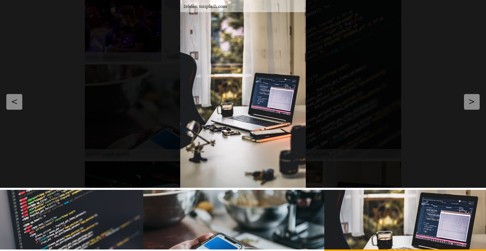

# JavaScript: Zdarzenia

Otrzymaliśmy zadanie, aby utworzyć pokaz slajdów (galeria), który będzie uruchamiany po klinięciu w element `<figure>`, który zawiera element ``. 

Klient ma już gotową część kodu HTML, CSS oraz JS.
Prosi nas, abyśmy HTML-a i CSS-a nie zmieniali, a w JavaScrip-cie trzymali się istniejącej już konwencji.

Element, w który będziemy klikać wygląda następująco:

```html
<figure class="gallery__item gallery__item--pos1">
    
    <figcaption class="gallery__caption">źródło: unsplash.com</figcaption>
</figure>
```

Natomiast kod HTML, który będziemy wykorzystywać do pokazów slajdów prezentuje sie w ten sposób:

```html
<section class="js-slider">
        <header class="js-slider__zoom">
            <span class="js-slider__nav js-slider__nav--prev">&lt;</span>
            <span class="js-slider__nav js-slider__nav--next">&gt;</span>
            <figure class="js-slider__wrapper">
                
                <figcaption class="js-slider__caption">źródło: unsplash.com</figcaption>
            </figure>
        </header>
        <footer class="js-slider__thumbs">
            <figure class="js-slider__thumbs-item js-slider__thumbs-item--prototype">
                
            </figure>
        </footer>
    </section>
```

* **.js-slider__zoom** - zawierać ma aktualnie prezentowane zdjęcie
* **.js-slider__thumbs** - zawierać będzie listę zdjęć o tej samej nazwie grupy, co kliknięte zdjęcie

> Nazwa grupy jest przechowywana w atrybucie `data-slider-group-name` i jest generowana automatycznie przez JS, aby zasymulować zmieniający się kod HTML. 

Efekt po klinięciu, w któryś z obazów na stronie powinien wyglądać jak na poniższym obrazie



## Implementacja

Nasze rozwiązanie ma się opierać w głównej mierze na własnych eventach (CustomEvent), których nazwy są następujące:

* **js-slider-img-click** - event, który jest uruchamiany po klinięciu w obrazek na stronie (jest to już zrobione w pliku `script.js`) i ma wyświetlić nasz pokaz slajdów

* **js-slider-img-next** - event, który jest uruchamiany po klinięciu w prawą strzałkę na stronie i ma pokazać kolejny obrazek z dostępny w miniaturach o ile w ogóle stnieje.

* **js-slider-img-prev** - podobnie jak wyżej tylko chodzi o lewą strzałkę

* **js-slider-close** - event, który jest uruchamiany po klinięciu na wolną przestrzeń wokół prezentowanego zdjęcia czyli w element `.js-slider__zoom` (i tylko w ten element - trzeba uważasz na propagację event-ów).

Do uruchomienia eventów będziemy używać napisanej już funkcji `fireCustomEvent`:

```javascript
const fireCustomEvent = function(element, name) {
    console.log(element.className, '=>', name);

    const event = new CustomEvent(name, {
        bubbles: true,
    });

    element.dispatchEvent( event );
}
```

Dla ułatwienia funkcja ta posiada `console.log`, która prezentuje nam informacje jaki event jest odpalany i na jakim elemencie.

Zauważ również, że funkcja ta przyjmuje dwa parametry. Pierwszy to element na jakim ma być wywołany event, a drugi to jego nazwa.

> Zajrzyj do pliku `./assets/js/script.js`, w którym masz opisane działania, które są niezbędne do wykonania zadania.

> Zapoznaj się dokładnie ze strukturą HTML i CSS, co powinno Ci pomóc w odpowiednim zrealizowaniu wyzwania.

## Dodatkowe zadania

### Zadanie dodatkowe 1

Możesz spróbować napisać kod, który pozwoli przełączać obrazki w nieskończoność po klinięciu w nawigację tj. jeśli nie mamy już następnego obrazka (lub poprzedniego) to wracamy do początku (lub końca).

### Zadanie dodatkowe 2

Tworzymy kod, który automatycznie, co zadaną ilość czasu sam przełącza obrazki.