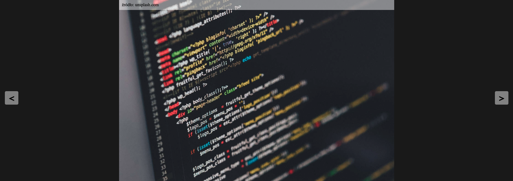

# JavaScript Events

## :technologist: Technologies and metodologies

This project was created to develop and improve my skills in JavaScript Events.

Check live version: **[LIVE](https://rafalkazik.github.io/js-slider-project/)**

In this task, my job was to create event:

- showing current photo;
- showing random photos as a bottom slider;
- choosing next or previous photo;
- closing preview if user clicks outside the image field (using propagation).

## :mailbox: Feel free to contact me

You can find me on **[LINKEDIN](https://www.linkedin.com/in/rafa%C5%82-kazik-924b8710a/)**

## Thanks :handshake:

Thanks to my [Mentor - devmentor.pl](https://www.devmentor.pl) - for providing me with this task and for code review.
